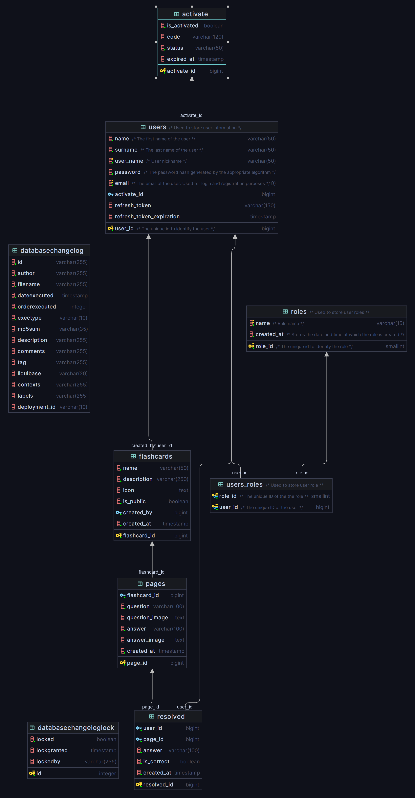

# Flashcards

A simple web application written in Angular and Java.

## Overview

Flashcards is an application for creating and solving flashcards. It features a responsive user interface and connections to a PostgreSQL database and RabbitMQ.

## Technologies

- Angular
- Java
- WebFlux
- RabbitMQ
- PostgreSQL
- Liquibase
- Docker

## Services

- **mail**:  
  It's a service written in Java and Spring Framework. It listens for messages sent by the service to the queue and sends an activation email if the user has registered correctly.

- **db**:  
  This is the service where changelogs for the Liquibase tool are stored.

- **service**:  
  This is the main application written in Java and Spring Framework. It uses the Spring Webflux reactive programming library.

- **auth**:  
  This is a service that deals with user authorization and registration, after correct registration sends a message to the queue to send an email through the mail service

- **gateway**
  This service allow to connect to multiple instances of other services
## Getting Started

1. Start PostgreSQL and RabbitMQ with Docker Compose under directory /infrastructure:
   ```bash
   docker-compose up
   ```
2. Apply database migrations:
   ```bash
   gradle :db:update
   ```
3. Start the gateway service:
   ```bash
   gradle :gateway:bootRun
   ```
4. Start the auth service:
   ```bash
   gradle :auth:bootRun
   ```
5. Start the main service:
   ```bash
   gradle :service:bootRun
   ```
6. Start the mail service:
   ```bash
   gradle :mail:bootRun
   ```
7. Start the Angular client:
   ```bash
   ng serve
   ```
8. Access the application at `http://localhost:4200/`.

## Docker compose
Project is fully configured tu run under docker environment. You can run automatically all services in few steps.
1. Build application: 
    ```bash
    gradle build
   ```
2. Start all services
   ```bash
   docker-compose up --build
   ```
3. Access the application at `http://localhost:4200/`.

## Database

The project uses a PostgreSQL database, which is managed by Liquibase. Liquibase is used to manage database migrations and write code in multiple formats, which is then converted to SQL. In this project, I use XML notation.

Entity Relationship Diagram (ERD)



## Endpoints

### FlashcardsController

#### `POST /`

**Description**:  
Saves new flashcards.

**Request Body**:
```json
{
  "name": "string",
  "questions": ["string"]
}
```

**Response**:  
- **204 No Content** – Successfully saved.  
- **500 Internal Server Error** – Server error.

#### `GET /list`

**Description**:  
Retrieves a list of flashcards with an optional filter by name.

**Query Parameters**:  
- `name` *(optional)* – Filter flashcards by name.

**Response**:  
- **200 OK** – List of flashcards.

---

### PagesController

#### `GET /pages/{flashcardId}`

**Description**:  
Gets pages related to a specific flashcard.

**Path Variables**:  
- `flashcardId` – The flashcard ID.

**Response**:  
- **200 OK** – Pages associated with the flashcard.

#### `GET /pages/{flashcardId}/{previousPageId}`

**Description**:  
Gets pages related to a specific flashcard and a previous page.

**Path Variables**:  
- `flashcardId` – The flashcard ID.  
- `previousPageId` – The previous page ID.

**Response**:  
- **200 OK** – Pages matching the criteria.

---

### ResolvedController

#### `POST /resolve`

**Description**:  
Saves a user's attempt at solving a flashcard.

**Request Body**:
```json
{
  "flashcardId": "number",
  "answers": ["string"]
}
```

**Response**:  
- **204 No Content** – Successfully saved the attempt.  
- **500 Internal Server Error** – Server error.

## Docker Configuration

This project uses Docker Compose to manage services in a unified environment.

### Key Services

- **PostgreSQL**:  
  Stores application data. Exposed on port `5432`.

- **RabbitMQ**:  
  Message broker for communication between services. Management UI available at `http://localhost:15672`.

- **Backend Services**:  
  - `server`: Main backend service.  
  - `auth`: User authorization service.  
  - `mail`: Email notification service.  
  - `gateway`: API gateway, exposed on port `8080`.

- **Frontend**:  
  Angular client available at `http://localhost:4200`.

### Running the Application

To start all services:

```bash
docker-compose up --build
```
